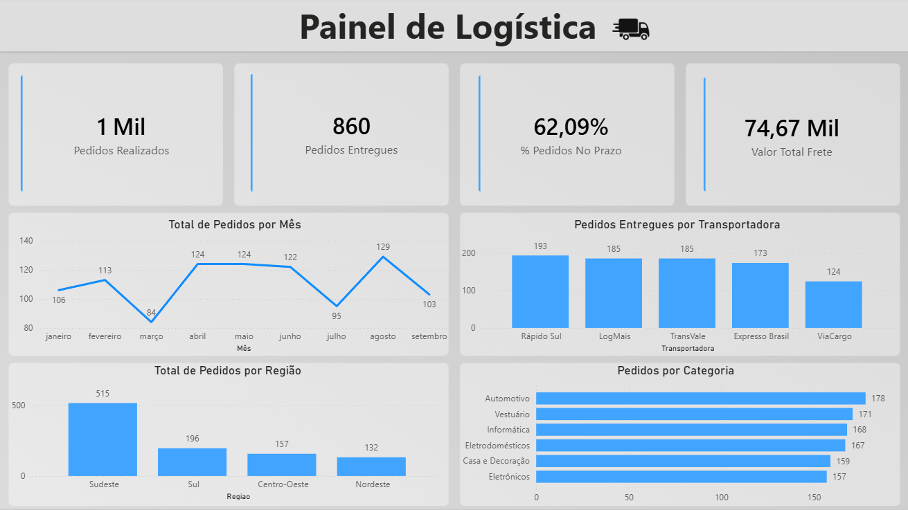

# Dashboard de Logística e Entregas — Power BI

Dashboard desenvolvido para análise de indicadores de logística e entregas, com o objetivo de transformar dados de pedidos em informações visuais para acompanhamento do desempenho da operação.

## Dashboard

  

## Sobre os dados

A base utilizada contém informações de 1.000 pedidos, incluindo dados como:

- ID do pedido
- Data do pedido
- Data prevista
- Data de entrega
- Cliente
- Cidade
- Estado
- Região
- Transportadora
- Categoria
- Peso
- Valor do frete
- Status do pedido
- Prazo de entrega
- Dias de entrega

## O que o dashboard apresenta

### Indicadores

- Total de pedidos realizados
- Total de pedidos entregues
- Percentual de pedidos realizados no prazo
- Valor total gasto com fretes

### Gráficos e análises

- Total de pedidos por mês: acompanhamento da evolução da quantidade de pedidos ao longo do tempo.
- Pedidos por transportadora: análise da quantidade de pedidos associados a cada transportadora.
- Pedidos por região: distribuição dos pedidos entre as diferentes regiões presentes na base.
- Pedidos por categoria: análise da quantidade de pedidos de acordo com cada categoria.

## Principais aprendizados

Durante o desenvolvimento do projeto, foram praticados conceitos como:

- Tratamento e organização de dados utilizando Power Query
- Criação e utilização de medidas DAX
- Criação de indicadores (Cards/KPIs)
- Criação e configuração de gráficos
- Utilização de gráfico de linhas
- Utilização de gráfico de colunas
- Análise de pedidos ao longo do tempo
- Análise de pedidos por transportadora
- Análise de pedidos por região
- Análise de pedidos por categoria
- Cálculo do percentual de pedidos realizados no prazo
- Cálculo do valor total de fretes
- Criação de filtros e interação entre os elementos do dashboard
- Organização e apresentação visual de indicadores logísticos

## Ferramentas utilizadas

- Power BI Desktop
- Power Query
- DAX
- Microsoft Excel

## Autor

Henrique Jesus Amorim da Cruz
